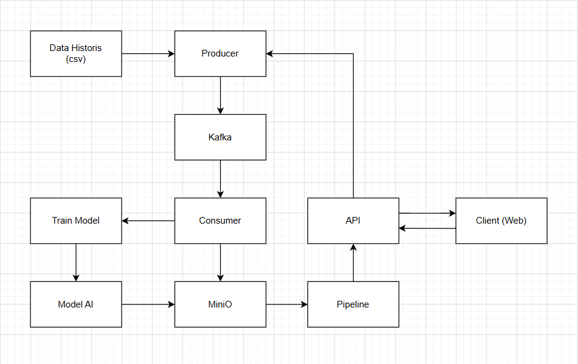

# Final Project Big Data dan Data Lakehouse
## Anggota Kelompok
| Nrp | Anggota Kelompok |
| --- | --- |
| 5027221031 | Gavriel Pramuda Kurniaadi |
| 5027221049 | Arsyad Rizantha M.S. |
| 5027221050 | Jody Hezekiah T.S. |
| 5027221059 | M. Ida Bagus Rafi Habibie |

## Overview
Implementasi Data Lakehouse pada Tokopedia

## Dataset
https://www.kaggle.com/datasets/farhan999/tokopedia-product-reviews/data

## Arsitektur


## Cara menjalankan
1. Run Docker
```bash
docker-compose up -d
```

2. Run Kafka
```bash
docker exec -it kafka kafka-topics.sh --create --topic product-review --bootstrap-server localhost:9092 --partitions 1 --replication-factor 1
docker exec -it kafka kafka-topics.sh --create --topic product-input --bootstrap-server localhost:9092 --partitions 1 --replication-factor 1
```

3. Login Minio
```txt
minio/minio123
```

4. Run start.sh
```bash
bash start.sh
```

5. Run main
```bash
cd main
python3 api/app.py 
python3 kafka/consumer.py
```

6. Run web
```bash
cd main/web
python3 -m http.server 8080
```